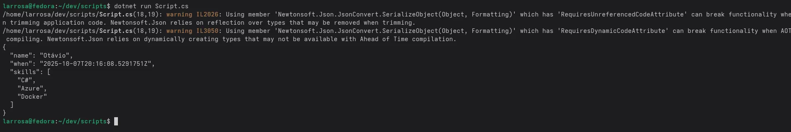

# Rodando C# scripts diretamente no terminal — Sem .csproj

Uma coisa que sempre senti falta no .NET/C# desde que comecei a usar, foi a capacidade de criar pequenos scripts para automatizar tarefas simples do dia a dia, assim como era possível fazer em Python, ou em Ruby. Eu realmente tinha inveja que eles podiam fazer isso.

Confesso também que na época não entendia muito bem a diferença entre linguagens compiladas, interpretadas ou híbridas como C# e Java.

Mas agora, com a próxima versão do .NET 10 que está em *release candidate*, será possível criar esses scripts, muito mais facilmente.

Abaixo mostro como fazer isso, de maneira **BEM SIMPLES**.

### Requerimentos
* .NET 10 instalado.

### Criando o arquivo
Vamos criar o arquivo `.cs` com:
```bash
touch Script.cs
```

### Editando o Script
Agora, edite o arquivo para incluir o código abaixo. Note que estamos usando um pacote externo do Nuget diretamente no script.

```csharp
// Utiliza o novo sistema de pacotes do C# 10, baseado em diretivas de pré-processamento.
// Da mesma forma que temos: #if, #else, #endif, etc...
#:package Newtonsoft.Json@13.*

using Newtonsoft.Json;
using System;
using System.Collections.Generic;

var payload = new Dictionary<string, object>
{
    ["name"] = "Otávio",
    ["when"] = DateTime.UtcNow,
    ["skills"] = new[] { "C#", "Azure", "Docker" }
};

Console.WriteLine(JsonConvert.SerializeObject(payload, Formatting.Indented));
```

### Executando
Pronto, agora salve e execute com:
```bash
dotnet run Script.cs
```

### Resultado
Você deve ter como resultado, algo assim:



### Conclusão

Pronto, agora você pode fazer suas POCs, automações ou testes de maneira extremamente simples, utilizando as dependências que você precisa, de maneira muito mais rápida.

E eu, bom eu posso dormir em paz, pois agora tenho uma das ferramentas que eu mais sentia falta no ecossistema :)